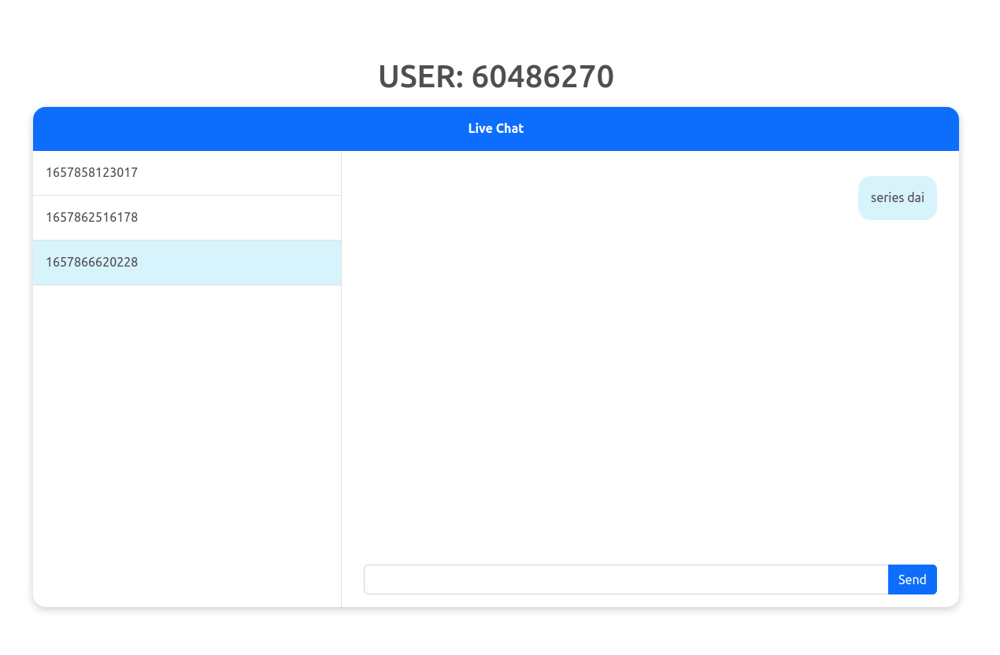

# Vanilla js and Raw express One to One Chat

- Typescript
- Socket.io
- session based one to one chat
- socket emit to both sender and receiver
- UI with bootstrap
- Chat with all the connected users
- Socket broadcast new users
- Play Notification sound on new message

